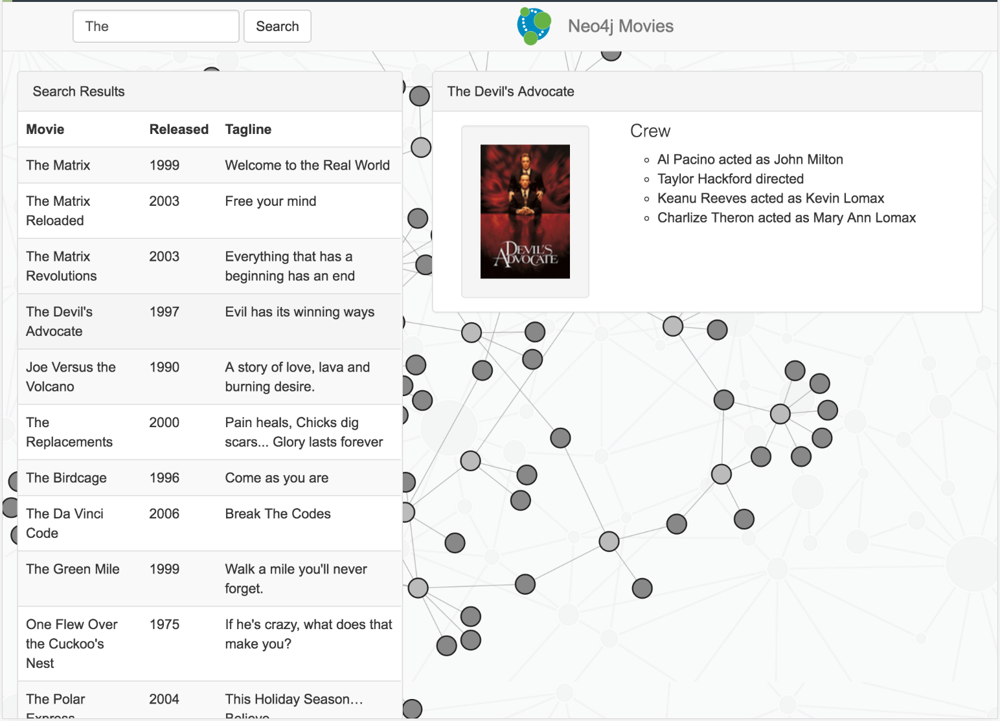

# Neo4j Movies Example Application - `neo4j-driver` Edition



## Stack

* [Neo4j Bolt JavaScript Driver](https://github.com/neo4j/neo4j-javascript-driver)
* Neo4j
* Frontend: ES6, jquery, bootstrap, [d3.js](http://d3js.org/)
* Webpack for building web assets

## Quickstart

### Setup

```bash
$ npm install
```

### Run locally

* Start Neo4j ([Download & Install](http://neo4j.com/download)) locally and open the [Neo4j Browser](http://localhost:7474). 
* Install the Movies dataset with `:play movies`, click the statement, and hit the triangular "Run" button.
* Clone this project from GitHub
* Run the App inside the Webpack Dev Server:

```bash
# run in developement mode (refreshes the app on source code changes)
$ npm run dev

# builds the release version with client assets in "build" directory
$ npm run build
```

When running in "dev" mode navigate to [http://localhost:8080/webpack-dev-server/](http://localhost:8080/webpack-dev-server/) to see the application.

After executing the `npm run build` command,  open local file "build/index.html" in your browser.
